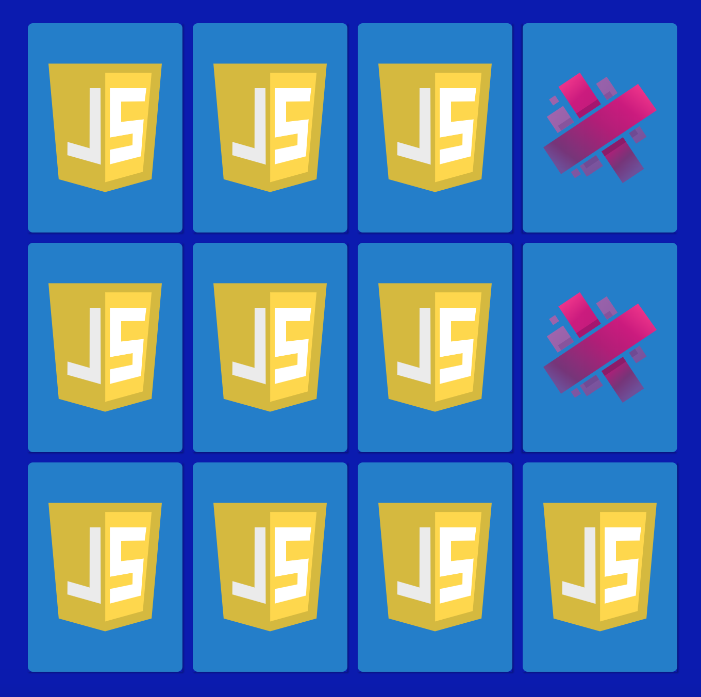

# MatchCards

This game is created using VanillaJS, HTML and CSS. It is a complete 
copy of code-sketch's [memory-game](https://github.com/code-sketch/memory-game). Copied only for learning purpose, while reading and
article of [TProger](https://vk.com/@itcookies-sozdaem-prostuu-igru-na-vanilla-js).

### Screenshot

---

### What can be added
- Choosing level using number of cards total
- Giving hint in no action during 10 seconds
- Congratulations modal with start again button
- Change the design in real time (dark and light mode)
- Type of cards can be choosen in the beginning (e.g Toys, Logos, Flowers, Cars etc.)

